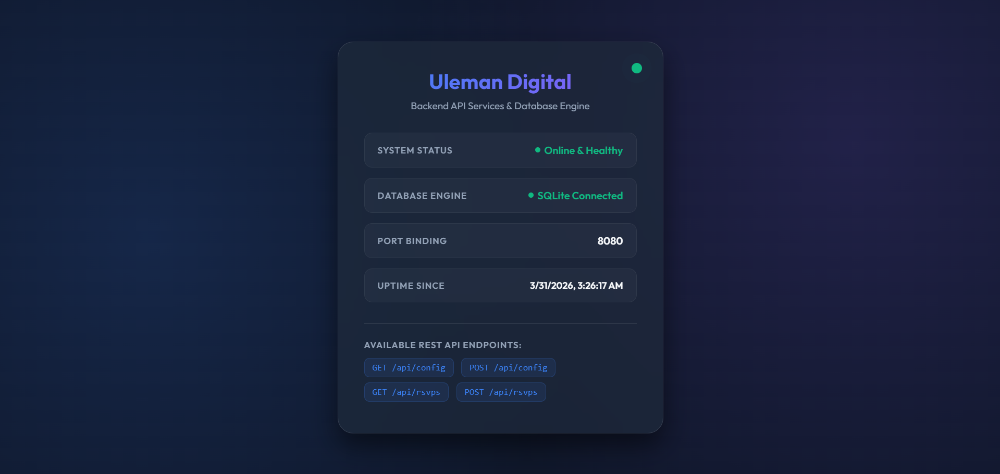

# Uleman Digital Backend

A robust Node.js and Express backend service for the **Uleman Digital** platform — a dynamic, localized, and highly customizable digital wedding invitation system. 

This backend acts as the core data engine, handling wedding configurations, dynamic content administration, file uploads (images & background music), and comprehensive RSVP management.

## 🖼️ Preview



> Tampilan **Status Web UI** bawaan yang dapat diakses di root endpoint (`/`), menampilkan status sistem, koneksi database, port aktif, uptime server, dan daftar REST API endpoint yang tersedia.

## 🚀 Features

- **Dynamic Configuration API**: Read and update all details (couple names, dates, maps, themes, banking information for gifts) from an admin dashboard.
- **RSVP Handling**: Securely submit and retrieve guest RSVPs.
- **Media Uploads Engine**: Built-in support for uploading hero backgrounds, profile photos, and background music using `multer`.
- **Smart File Cleanup**: Automatically detects and deletes old files when new ones are uploaded to prevent storage bloat.
- **Lightweight Database**: Powered by SQLite3 with an *auto-healing* schema that seeds default configurations if none exist.
- **Status WebUI**: Built-in system status dashboard available at the root (`/`) to monitor uptime and health.
- **Cloud-Ready**: Native support for persistent storage directory overrides, perfect for zero-downtime deployments on platforms like Railway.

## 🛠️ Technology Stack

- **Runtime**: Node.js
- **Framework**: Express.js
- **Database**: SQLite3
- **File Storage**: Multer
- **Middleware**: CORS

## 📦 Getting Started

### Prerequisites
- Node.js (v16.x or later recommended)
- npm or yarn

### Installation

1. **Clone the repository:**
   ```bash
   git clone https://github.com/derisamedia/Uleman-Digital-Backend.git
   cd Uleman-Digital-Backend
   ```

2. **Install dependencies:**
   ```bash
   npm install
   ```

3. **Start the development server:**
   ```bash
   node server.js
   ```
   The backend will start and listen on `http://localhost:5000` by default.

## ⚙️ Environment Variables

You can customize the backend behavior using the following environment variables.

| Variable | Description | Default |
|----------|-------------|---------|
| `PORT` | The port on which the server listens. | `5000` |
| `DATA_DIR` | Custom directory to persist the SQLite database (`uleman_v3.db`) and `uploads/` folder. Essential for cloud deployments. | Current directory (`./`) |
| `BASE_URL` | Base URL used to formulate full URLs for uploaded files (e.g., `https://api.domain.com`). | Inferred from request (`protocol://host`) |

## 📡 API Endpoints

### 🔧 Configuration

- **`GET /api/config`** 
  Retrieves the current wedding configuration.
- **`POST /api/config`** 
  Updates the configuration. Accepts `multipart/form-data` for simultaneously updating text fields and uploading new files.

### 💌 RSVPs

- **`GET /api/rsvps`** 
  Retrieves all submitted RSVPs grouped by newest first.
- **`POST /api/rsvps`** 
  Submits a new RSVP. 
  *Required Body:* `{ "name": "...", "status": "Hadir", "guests": 2 }`

### 🌐 System

- **`GET /`** 
  Returns a beautifully styled Status Web UI showcasing API health, SQLite connection, and active endpoints.

## ☁️ Deployment Guide (Railway, Render, etc.)

Because this project utilizes SQLite and local file uploads, you must configure a **Persistent Volume** in your hosting provider to prevent data loss upon redeployments.

**Example for Railway:**
1. Go to your Railway project and add a **Volume**.
2. Mount the volume to a specific path (e.g., `/data`).
3. Add an Environment Variable: `DATA_DIR=/data`.

The app will automatically route all SQLite operations and file uploads to your persistent `/data` directory!

## 📄 License & Authorship

Developed by [derisamedia](https://github.com/derisamedia).
Licensed under the ISC License.
